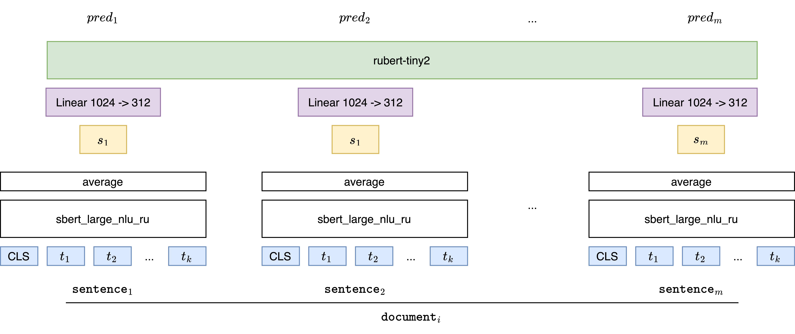
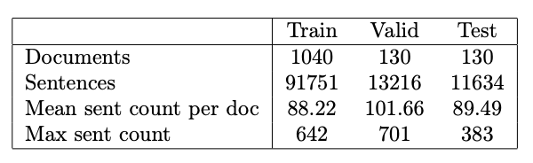

#  📑 TESEY

TExt SEgmentation model trained on TJournal dataset.



## Structure
* [`baselines`](./baselines) ‒ the open source implementations of some existion solutions for text segmentation.
* [`src`](./src) ‒ main source code with model and dataset implementations and code of some useful functions.
* [`configs`](./configs) ‒ parameters of model training in yaml format.
* [`notebooks`](./notebooks) ‒ notebooks with data analysis.
* [`scrapers`](./scrapers) ‒ code for collecting data from the [tjournal](https://tjournal.ru) website for text segmentation.
* [`scripts`](./scripts) ‒ scripts for preprocessing data, train or eval models.

## Requirements
Create virtual environment with `venv` or `conda` and install requirements:
```shell
pip install -r requirements.txt
```

## Data

The data is collected from the [tjournal](https://tjournal.ru) source.

The data can be found at the [link](https://disk.yandex.ru/d/bS894Ls0OdE5ug).

* `data.jsonl` ‒ the full datasets
* `{train/val/test}.jsonl` ‒ the subsets of the datasets:

* `sentence_embeddings_{train/val/test}.jsonl` ‒ Embedding of offers received with [sbert_large_nlu_ru](https://huggingface.co/ai-forever/sbert_large_nlu_ru).
* `test_inputs` ‒ documents from the test subsample in text format (without splitting).
* `test_outputs` ‒ the partition obtained using the [GraphSeg](https://aclanthology.org/S16-2016.pdf) algorithm for `test_inputs`.

the format of `data.jsonl` and `{train/val/test}.jsonl` is following:

```shell
document_1
document_2
...
document_n
```

The structure of the document_i is:

```shell
[
  [sentence_1, label_1],
  [sentence_2, label_2], 
  ... 
  [sentence_m, label_m]
]
```

where label is equal 0 or 1. 1 ‒ the sentence is the beginning of the paragraph, 0 otherwise.

The `sentence_embeddings_{train/val/test}.jsonl` files have the following structure:

```shell
doc_dict_1
doc_dict_2
...
doc_dict_n
```

doc_dict_i:
```shell
{
  "sentence_embeddings": [vector_1, vector2, ... vectorm],
  "labels": [label_1, label_2, ..., label_m]
}
```

where `vector_i` is a float vector of size 1024.

## Model

Initially, individual sentences within each document undergo independent processing. They are tokenized and passed as input to the pre-trained Sentence-BERT model, denoted as `BERT_sent`. The outputs of `BERT_sent`, comprising a number of vectors equivalent to the number of tokens in the sentence, are subsequently averaged. The resultant vector represents the embedding of the corresponding sentence.

Consequently, the document is transformed into a sequence of sentence vectors. These vectors are then fed as input to another BERT model, denoted as `BERT_seg`. However, it is noteworthy that the dimensionality of these vectors may not align with the internal dimensionality of `BERT_seg`. To address this discrepancy, a linear layer is employed to convert the vectors to the desired dimension. The output vectors of `BERT_seg`, whose count corresponds to the number of sentences in the document, undergo further processing through a linear layer. This layer provides the probability that a given sentence serves as the opening sentence of a new paragraph.

Due to the high computational cost associated with maintaining two BERT-like models in GPU memory, only the weights of `BERT_seg` are modified during the training process. To overcome this challenge, all documents were preprocessed in advance, and the vectors for each sentence were saved to a file for improved speed and convenience.

It is widely recognized that BERT models from the Sentence-BERT family yield optimal vector representations of sentences. Therefore, the [sbert_large_nlu_ru](https://huggingface.co/ai-forever/sbert_large_nlu_ru) model, pretrained in Russian, was selected as `BERT_sent` for this study. This model consists of 16 encoder layers and 12 attention heads within each layer. The output vectors from `BERT_sent` have a dimensionality of 1024. Furthermore, the number of positional embeddings is constrained to 512, necessitating the truncation of sentences to adhere to this limit.

For quick training , [rubert-tiny2](https://huggingface.co/cointegrated/rubert-tiny2) was taken as `BERT_seg`. It has an embedding size of 312, so sentence embeddings were processed by a linear layer 1024 -> 312. It has 3 layers and 12 heads of attention. Its limit on the input sequence is 2048. All documents in the training, test and validation subsets have fewer sentences, so nothing had to be cut. In the next section, we will take a closer look at the dataset and the partitioning into subsets.

## Run

### Our approach

To run the training model run the script:

```shell
python -m scripts.train --config configs/default.yaml
```

### Text Segmentation as a Supervised Learning Task

To evaluate the models from the article [Text Segmentation as a Supervised Learning Task](https://aclanthology.org/N18-2075.pdf) download the model weights and word2vec embeddings: 
* [model](https://www.dropbox.com/sh/k3jh0fjbyr0gw0a/AADzAd9SDTrBnvs1qLCJY5cza?dl=0)
* [w2v](https://drive.google.com/a/audioburst.com/uc?export=download&confirm=zrin&id=0B7XkCwpI5KDYNlNUTTlSS21pQmM)
Put this file to `baselines/test-segmentation`

Create environment since the source code is written in outdated python 2.7.
```shell
cd baselines/text-segmentation
conda create -n textseg python=2.7 numpy scipy gensim ipython 
source activate textseg
pip install http://download.pytorch.org/whl/cu80/torch-0.3.0-cp27-cp27mu-linux_x86_64.whl 
pip install tqdm pathlib2 segeval tensorboard_logger flask flask_wtf nltk
pip install pandas xlrd xlsxwriter termcolor
```

And run the script:

```shell
python2.7 -m eval_tjournal
```

Note that the test dataset must be located in `data/test.jsonl` relative to the repository root.

### Structural Text Segmentation of Legal Documents

To evaluate model from the article [Structural Text Segmentation of Legal Documents](https://arxiv.org/pdf/2012.03619.pdf) on `test.jsonl` dataset use the following command:

```shell
python -m scripts.eval_structural_text_segmentation \
  --model dennlinger/roberta-cls-consec \
  --data data/test.jsonl \
  --max-len 512
```
model can be either `dennlinger/roberta-cls-consec` or `dennlinger/roberta-cls-consec`

#### Unsupervised Text Segmentation Using Semantic Relatedness Graphs

To run the algorithm from the paper [Unsupervised Text Segmentation Using Semantic Relatedness Graphs](https://aclanthology.org/S16-2016.pdf) run the following command:

```shell
cd baselines/graphseg/binary
java -jar graphseg.jar <absolute path to the test_input directory> <absolute path to the empty directory for outputs> 0.25 1
```

To compute the metrics for the obtained outputs run the script:

```shell
python -m scripts.eval_graphseg \
  --test-dataset data/test.jsonl \
  --graphseg-output data/test_outputs
```